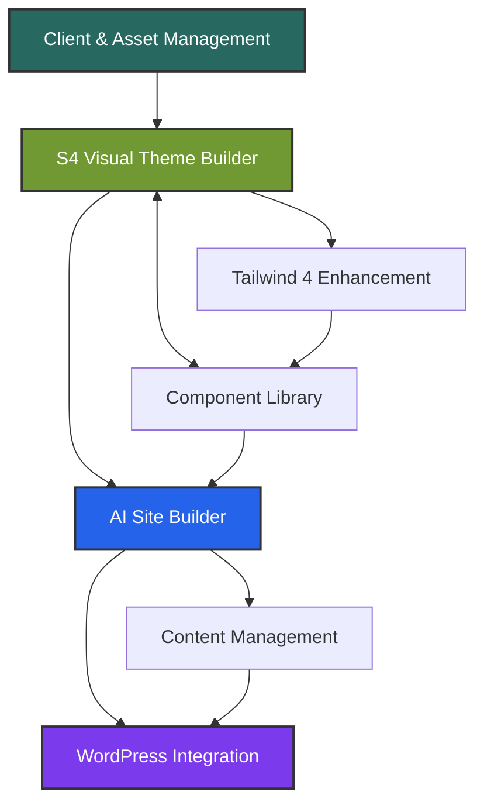

# THE STUDIO DESIGN SYSTEM PLATFORM
## Master Roadmap & Architecture

**Vision**: A revolutionary WordPress design system platform that empowers designers to create, manage, and deploy professional websites with unprecedented control and flexibility.

---

## 🏗️ **PLATFORM ARCHITECTURE**

### **Core Philosophy**
- **Designer-First**: Put control in designers' hands, not AI prompts
- **Visual Excellence**: High-design interface without utility color pollution
- **Infinite Flexibility**: S4 system enables endless variations from minimal code
- **WordPress Native**: Seamless integration with WP ecosystem

### **Technology Stack**
```
Frontend: React 18 + TypeScript + Tailwind 4
State: Redux Toolkit + JSON-based presets
Styling: S4 System + Tailwind utilities
Backend: WordPress REST API + Custom CPTs
Blocks: Daniel's HTML→WP Block parser
AI: Custom training on S4 system
```

---

## 📦 **MODULE BREAKDOWN**

### **CORE MODULES (Week 1 Focus)**

---

### **Module 2: S4 Visual Theme Builder**
**Purpose**: Professional theme creation with visual feedback

#### Features:
- **Brand Colors**: Multi-brand color management
- **Preset System**: Color, layout, typography, helper presets
- **Live Preview**: Real-time visual updates
- **Clean Visualization**: High-design interface like a Fashion Magazine or Interior Design Style Visualization.

#### Components:
1. **Color System**
   - Brand token management
   - Theme mapping (semantic assignments)
   - Color presets (default, emphasis, etc.)
   - Helper presets (hierarchy, saturation)

2. **Layout System**
   - Transformable layouts (center, split, fullwidth, sidebar)
   - Component scopes (hero, card, section)
   - Responsive presets

3. **Typography System**
   - Font stack management
   - Scale presets (default, compact, display)
   - Hierarchy presets

3. **Spacing System**
   - Scale presets (default, compact, display)

#### S4 Integration:
```css
/* Layer 1: Brand Tokens */
/* Layer 2: Global Elements */
/* Layer 3: Component Scopes */
/* Layer 4: Helper Scopes */
```

---

### **Module 3: Component Library & Builder**
**Purpose**: Visual component creation and management

#### Features:
- **Component Templates**: Pre-built transformable components
- **Visual Builder**: Drag-drop with S4 preset application
- **Variant System**: Multiple presentations per component
- **Export Options**: HTML, React, WP Blocks

#### Component Structure:
```json
{
  "component": "hero",
  "variants": {
    "center": { "layout": "center", "scope": "hero" },
    "split": { "layout": "split", "scope": "hero" },
    "card": { "layout": "center", "scope": "card" }
  }
}
```

---

### **Module 5: WordPress Integration**
**Purpose**: Seamless WP deployment and block conversion

#### Features:
- **Block Parser**: Daniel's HTML→WP block converter
- **Content & CPT Integration**: Custom post types from JSON
- **Dynamic Data**: Elegant HTML templating system
- **Block Library**: Generate Press, Greenshift Pro compatibility

#### Conversion Flow:
```
S4 HTML → Parser → Scoped WP Blocks → Live Site
```

---

### **Module 7: Tailwind 4 Enhancement Layer**
**Purpose**: Utility-first enhancements to S4 system

#### Integration Strategy:
```css
@theme {
  /* S4 tokens become TW utilities */
  --color-studio-primary: var(--color1);
  --spacing-studio: var(--space-unit);
}
```

#### Benefits:
- **Rapid Prototyping**: Utility classes for quick iterations
- **Dark Mode**: Built-in dark: variants
- **Responsive**: Mobile-first breakpoints
- **State Variants**: hover:, focus:, active:

---

### **FUTURE MODULES (Highlighted for Planning)**

- **Module 1: Client & Asset Management** - Multi-client project hub
- **Module 4: AI Site Builder** - Conversational site creation
- **Module 6: Content Management System** - JSON-based content

---

## 🚀 **WEEK 1 SPRINT PLAN**

### **Days 1-3: S4 Visual Theme Builder**
- [x] S4 system architecture complete
- [x] JSON preset structure defined
- [ ] React UI with live preview
- [ ] Color preset builder interface
- [ ] Layout transformer controls
- [ ] Export to CSS functionality

### **Days 4-5: Component Library**
- [ ] 5-6 core transformable components
- [ ] Visual component grid
- [ ] Variant preview system
- [ ] Component export options

### **Days 6-7: Integration & Polish**
- [ ] WordPress block prep (Daniel's parser)
- [ ] Tailwind 4 enhancement layer
- [ ] Clean CSS output
- [ ] Basic documentation

---

## 📅 **FUTURE PHASES**

### **Phase 2: Enhanced Features (Month 2)**
- Advanced typography system
- Effects and animations
- Responsive preview modes
- Theme library/marketplace

### **Phase 3: Client Management (Month 3)**
- Multi-client architecture
- Asset management system
- Project organization

### **Phase 4: AI Integration (Months 4-6)**
- Train on S4 patterns
- Conversational interface
- Site generation

---

## 🎯 **KEY DIFFERENTIATORS**

### **vs. Other Theme Builders**
- **Clean Design Visualization**: No utility color pollution
- **Transformable Components**: One component, infinite layouts
- **Designer Control**: Visual tools, not code
- **AI That Understands Design**: Trained on S4 system

### **vs. Relume**
- **Fully Editable**: Every aspect customizable
- **Custom Output**: Unique designs, not templates
- **WordPress Native**: Direct WP block integration
- **Visual Control**: See changes in real-time

### **vs. Traditional Development**
- **10x Faster**: Visual tools + AI assistance
- **Consistent Quality**: S4 system ensures harmony
- **No Code Required**: Designers work visually
- **Professional Output**: Clean, semantic code

---

## 📊 **SUCCESS METRICS**

### **Technical Goals**
- [ ] < 3 minutes to create new theme
- [ ] < 30 seconds to transform component layout
- [ ] 100% WordPress compatibility
- [ ] < 50kb CSS output for typical site

### **User Experience Goals**
- [ ] Zero code required for designers
- [ ] Intuitive visual feedback
- [ ] Professional design output
- [ ] Seamless WordPress integration

### **Business Goals**
- [ ] Reduce site development time by 80%
- [ ] Enable non-developers to create pro sites
- [ ] Scalable client management
- [ ] Competitive advantage through AI

---

## 🔗 **MODULE DEPENDENCIES**



---

## 📝 **NEXT IMMEDIATE ACTIONS**

1. **Finalize S4 System Documentation**
   - Complete preset examples
   - Document JSON structures
   - Create TypeScript interfaces

2. **Begin Module 1: Client Management**
   - Design data structure
   - Create React components
   - Implement client switching

3. **Start Module 2: Theme Builder**
   - Color preset interface
   - Layout transformer
   - Live preview system

4. **Plan AI Training**
   - Document S4 patterns
   - Create training datasets
   - Design conversation flow

---

## 🚧 **OPEN QUESTIONS**

1. **Hosting Strategy**: Where do client assets live?
2. **Collaboration**: Multi-user editing capabilities?
3. **Versioning**: How to handle theme versions?
4. **Marketplace**: Share/sell themes and components?

---

**The Studio Design System Platform represents a paradigm shift in how WordPress sites are designed and built - putting professional tools in designers' hands while leveraging AI for acceleration, not replacement.**