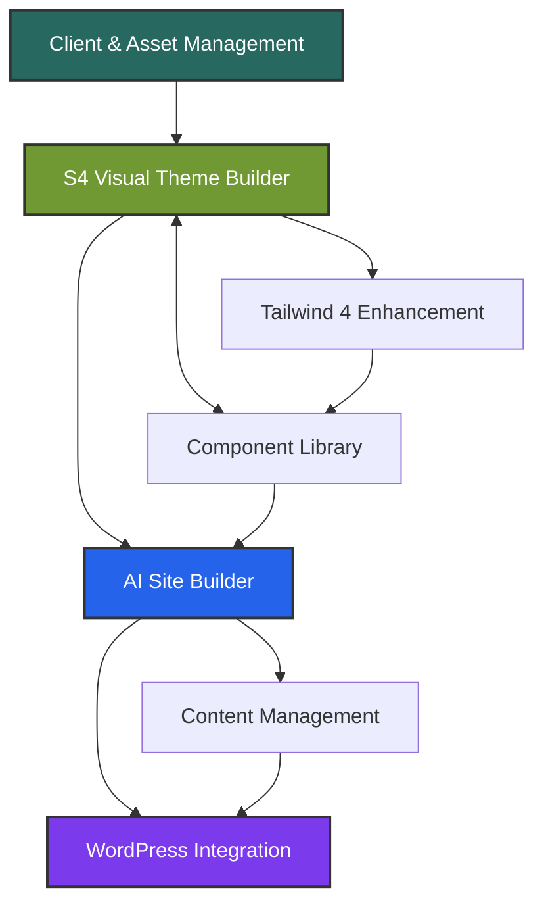

# THE STUDIO DESIGN SYSTEM PLATFORM
## Master Roadmap & Architecture

**Vision**: A revolutionary WordPress design system platform that empowers designers to create, manage, and deploy professional websites with unprecedented control and flexibility.

**🚀 CURRENT STATUS**: **Studio4 Plugin Live with S4 Theme Builder**  
**📅 Last Updated**: January 6, 2025  
**🎯 Active Phase**: Testing & Feature Enhancement

---

## 🏗️ **PLATFORM ARCHITECTURE**

### **Core Philosophy**
- **Designer-First**: AI Assisted Designer Tools
- **Visual Excellence**: High-design interface Simple Elegant Design
- **Infinite Flexibility**: S4 system enables endless variations
- **WordPress Native**: Seamless integration with WP ecosystem

### **Technology**

  Frontend Stack

  - React 18 with Hooks and modern patterns
  - Zustand for state management with localStorage
  persistence
  - Tailwind CSS 4 with @theme directive for design
  system
  - ShadCN Design System tokens (background, foreground,
  accent, etc.)
  - Shadow DOM complete style isolation from WordPress
  - Vite build system with hot reload for development
  - Daniel's R2WC Boilerplate (React to Web Component
  architecture)
  

  WordPress Integration

  - Daniel's Plugin Boilerplate architecture (singleton
  pattern)
  - Custom Web Component <studio4-builder> renders React
  in Shadow DOM
  - WordPress REST API endpoints at /wp-json/studio4/v1/
  - Server-Side CSS Injection via base64 encoding to
  prevent escaping
  - Database Storage custom table wp_studio4_data for
  settings
  - Admin Integration settings page with embedded web
  component
  - Proper WordPress Hooks activation, deactivation, and
  lifecycle management

  Build System

  - Dual Vite Configuration
    - Main build: vite.config.js (React bundle as IIFE)
    - CSS build: vite.config.css.js (Tailwind CSS 4
  compilation)
  - Output Files
    - dist/js/studio4.js (~1MB React bundle)
    - dist/css/main.css (~34KB Tailwind with ShadCN)
  - Development Commands
    - npm run dev - Hot reload development
    - npm run build - Production build + tests
    - npm run build:css - CSS-only build

  S4 Processing Engine

  - JSON-Based Presets stored in
  src/s4/presets/s4-presets.json
  - S4PresetProcessor class for CSS variable generation
  - Real-time CSS Generation brand colors → CSS variables
  - HSL Color Management with hex/HSL conversion
  utilities
  - Component State Management accordion UI with dynamic
  previews

  Current Architecture Patterns

  - Single Sidebar with accordion sections
  - Tab Navigation (Theme, Components, Inspector)
  - Dynamic Preview Area changes based on active section
  - Persistent Settings via Zustand + localStorage
  - Color Controls with HSL sliders embedded in
  accordions
  - Shadow DOM Isolation prevents WordPress theme
  conflicts
---

## 📦 **MODULE BREAKDOWN**

### **CORE MODULES (Week 1 Focus)**

---

### **Module 2: S4 Visual Theme Builder**
**Purpose**: Professional theme creation with visual feedback

#### Features:
- **Brand Colors**: Multi-brand color management
- **Preset System**: Color, layout, typography, helper presets
- **Live Preview**: Real-time visual updates
- **Clean Visualization**: High-design interface like a Fashion Magazine or Interior Design Style Visualization.

#### Components:
1. **Color System**
   - Brand token management
   - Theme mapping (semantic assignments)
   - Color presets (default, emphasis, etc.)
   - Helper presets (hierarchy, saturation)

2. **Layout System**
   - Transformable layouts (center, split, fullwidth, sidebar)
   - Component scopes (hero, card, section)
   - Responsive presets

3. **Typography System**
   - Font stack management
   - Scale presets (default, compact, display)
   - Hierarchy presets

3. **Spacing System**
   - Scale presets (default, compact, display)

#### S4 Integration:
```css
/* Layer 1: Brand Tokens */
/* Layer 2: Global Elements */
/* Layer 3: Component Scopes */
/* Layer 4: Helper Scopes */
```

---

### **Module 3: Component Library & Builder**
**Purpose**: Visual component creation and management

#### Features:
- **Component Templates**: Pre-built transformable components
- **Visual Builder**: Drag-drop with S4 preset application
- **Variant System**: Multiple presentations per component
- **Export Options**: HTML, React, WP Blocks

#### Component Structure:
```json
{
  "component": "hero",
  "variants": {
    "center": { "layout": "center", "scope": "hero" },
    "split": { "layout": "split", "scope": "hero" },
    "card": { "layout": "center", "scope": "card" }
  }
}
```

---

### **Module 5: WordPress Integration**
**Purpose**: Seamless WP deployment and block conversion

#### Features:
- **Block Parser**: Daniel's HTML→WP block converter
- **Content & CPT Integration**: Custom post types from JSON
- **Dynamic Data**: Elegant HTML templating system
- **Block Library**: Generate Press, Greenshift Pro compatibility

#### Conversion Flow:
```
S4 HTML → Parser → Scoped WP Blocks → Live Site
```

---

### **Module 7: Tailwind 4 Enhancement Layer**
**Purpose**: Utility-first enhancements to S4 system

#### Integration Strategy:
```css
@theme {
  /* S4 tokens become TW utilities */
  --color-studio-primary: var(--color1);
  --spacing-studio: var(--space-unit);
}
```

#### Benefits:
- **Rapid Prototyping**: Utility classes for quick iterations
- **Dark Mode**: Built-in dark: variants
- **Responsive**: Mobile-first breakpoints
- **State Variants**: hover:, focus:, active:

---

### **FUTURE MODULES (Highlighted for Planning)**

- **Module 1: Client & Asset Management** - Multi-client project hub
- **Module 4: AI Site Builder** - Conversational site creation
- **Module 6: Content Management System** - JSON-based content

---

## 🚀 **CURRENT IMPLEMENTATION STATUS**

### **Phase 1: Foundation Setup ✅**
- [x] WordPress plugin structure (using Daniel's R2WC boilerplate)
- [x] React Shadow DOM implementation
- [x] Zustand state management with persistence
- [x] Basic S4 theme builder interface
- [x] Dark mode UI with rose/gold accents

### **Phase 2: Brand & Typography (CURRENT) 🔄**
- [x] Brand color picker with HSL controls
- [x] Color persistence
- [x] Accordion-style UI with single sidebar
- [x] Dynamic preview system
- [ ] Typography stack selection
- [ ] Font management system
- [ ] Base sizing controls

### **Phase 3: Global Elements System 📋**
- [ ] Define complete element list:
  - section, container, wrapper
  - title, subtitle, pretitle, text
  - button-primary, button-secondary
  - link, list, divider
- [ ] Property matrix for each element:
  - color, background-color
  - border, border-radius
  - padding, margin
  - font-size, line-height
  - opacity, transition
- [ ] Generate comprehensive CSS variables

### **Phase 4: Color Preset System 📋**
- [ ] Default color preset (baseline mapping)
- [ ] Emphasis preset (high contrast)
- [ ] Dark mode preset
- [ ] Custom preset creation
- [ ] Preview all elements with presets

### **Phase 5: Helper Presets 📋**
- [ ] Typography hierarchy (lightness/opacity scales)
- [ ] Interactive states (hover, active, focus)
- [ ] Saturation modifiers (vibrant, muted, grayscale)
- [ ] Custom helper creation

### **Phase 6: Component Scopes 📋**
- [ ] Hero scope variations:
  - Center aligned
  - Half-page split
  - Full-width background
- [ ] Card scope variations:
  - Grid layout
  - List layout
  - Featured card
- [ ] Sidebar scope
- [ ] Footer scope

### **Phase 7: Layout Transformations 📋**
- [ ] Component layout engine
- [ ] Responsive variations
- [ ] Animation transitions
- [ ] Layout preset library

### **Phase 8: Integration & Export 📋**
- [ ] CSS generation engine
- [ ] WordPress theme export
- [ ] Gutenberg block styles
- [ ] JSON configuration export
- [ ] Import/export system

---

## 📅 **FUTURE PHASES**

### **Phase 2: Enhanced Features (Month 2)**
- Advanced typography system
- Effects and animations
- Responsive preview modes
- Theme library/marketplace

### **Phase 3: Client Management (Month 3)**
- Multi-client architecture
- Asset management system
- Project organization

### **Phase 4: AI Integration (Months 4-6)**
- Train on S4 patterns
- Conversational interface
- Site generation

---

## 🎯 **KEY DIFFERENTIATORS**

### **vs. Other Theme Builders**
- **Clean Design Visualization**: No utility color pollution
- **Transformable Components**: One component, infinite layouts
- **Designer Control**: Visual tools, not code
- **AI That Understands Design**: Trained on S4 system

### **vs. Relume**
- **Fully Editable**: Every aspect customizable
- **Custom Output**: Unique designs, not templates
- **WordPress Native**: Direct WP block integration
- **Visual Control**: See changes in real-time

### **vs. Traditional Development**
- **10x Faster**: Visual tools + AI assistance
- **Consistent Quality**: S4 system ensures harmony
- **No Code Required**: Designers work visually
- **Professional Output**: Clean, semantic code

---

## 📊 **SUCCESS METRICS**

### **Technical Goals**
- [ ] < 3 minutes to create new theme
- [ ] < 30 seconds to transform component layout
- [ ] 100% WordPress compatibility
- [ ] < 50kb CSS output for typical site

### **User Experience Goals**
- [ ] Zero code required for designers
- [ ] Intuitive visual feedback
- [ ] Professional design output
- [ ] Seamless WordPress integration

### **Business Goals**
- [ ] Reduce site development time by 80%
- [ ] Enable non-developers to create pro sites
- [ ] Scalable client management
- [ ] Competitive advantage through AI

---

## 🔗 **MODULE DEPENDENCIES**



---

## 📝 **NEXT IMMEDIATE ACTIONS**

1. **Finalize S4 System Documentation**
   - Complete preset examples
   - Document JSON structures
   - Create TypeScript interfaces

2. **Begin Module 1: Client Management**
   - Design data structure
   - Create React components
   - Implement client switching

3. **Start Module 2: Theme Builder**
   - Color preset interface
   - Layout transformer
   - Live preview system

4. **Plan AI Training**
   - Document S4 patterns
   - Create training datasets
   - Design conversation flow

---

## 🚧 **OPEN QUESTIONS**

1. **Hosting Strategy**: Where do client assets live?
2. **Collaboration**: Multi-user editing capabilities?
3. **Versioning**: How to handle theme versions?
4. **Marketplace**: Share/sell themes and components?

---

**The Studio Design System Platform represents a paradigm shift in how WordPress sites are designed and built - putting professional tools in designers' hands while leveraging AI for acceleration, not replacement.**